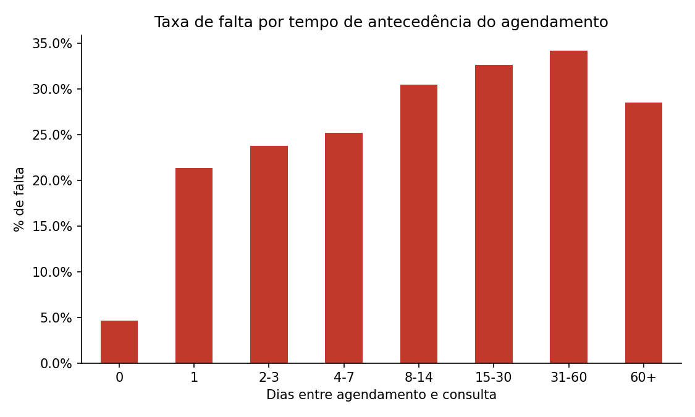
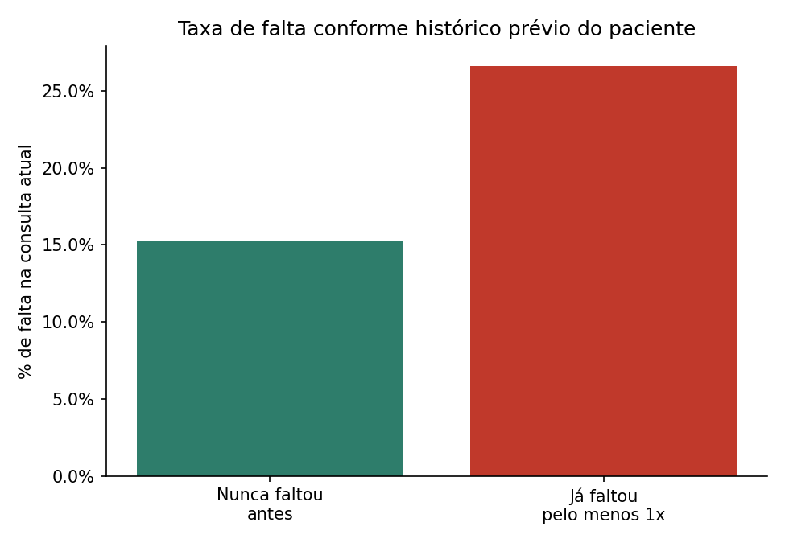
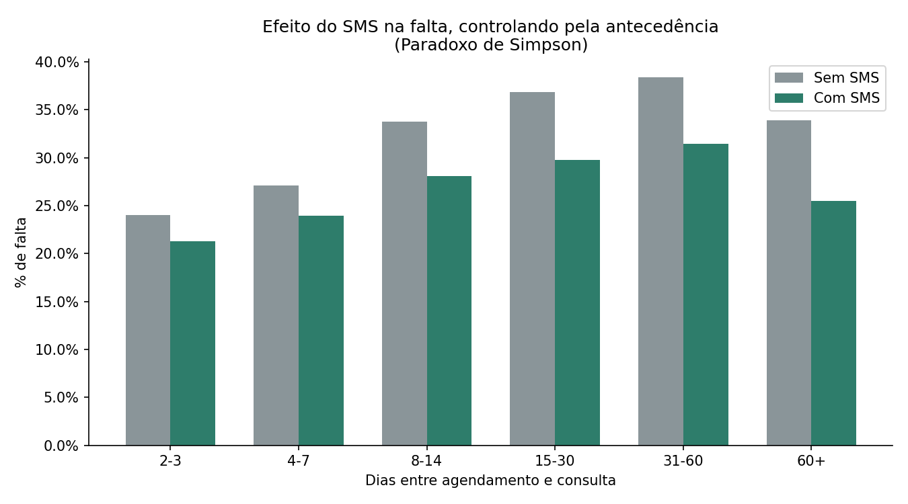
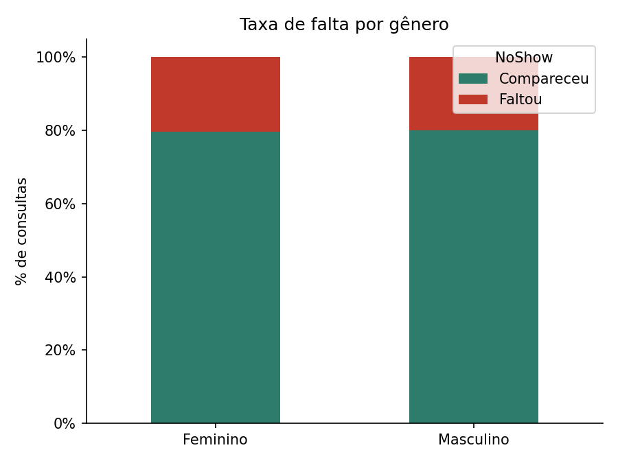
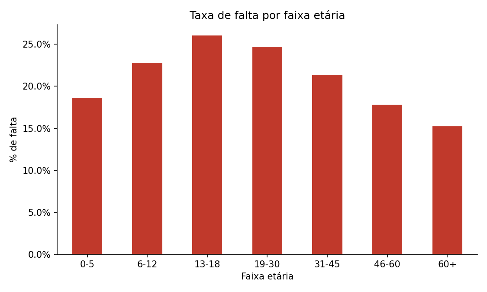
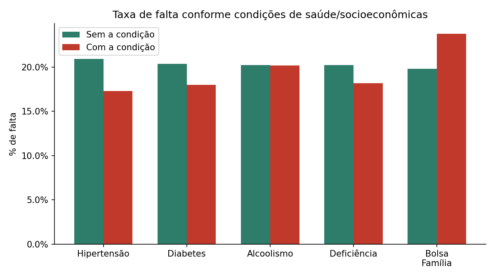
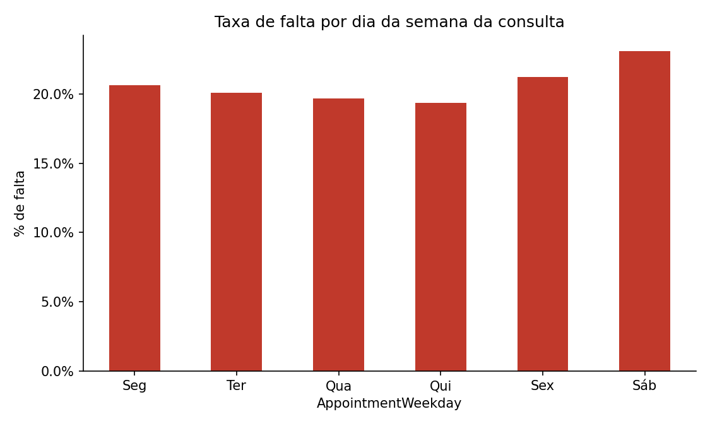
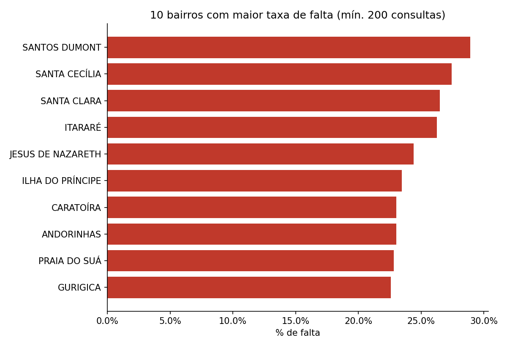
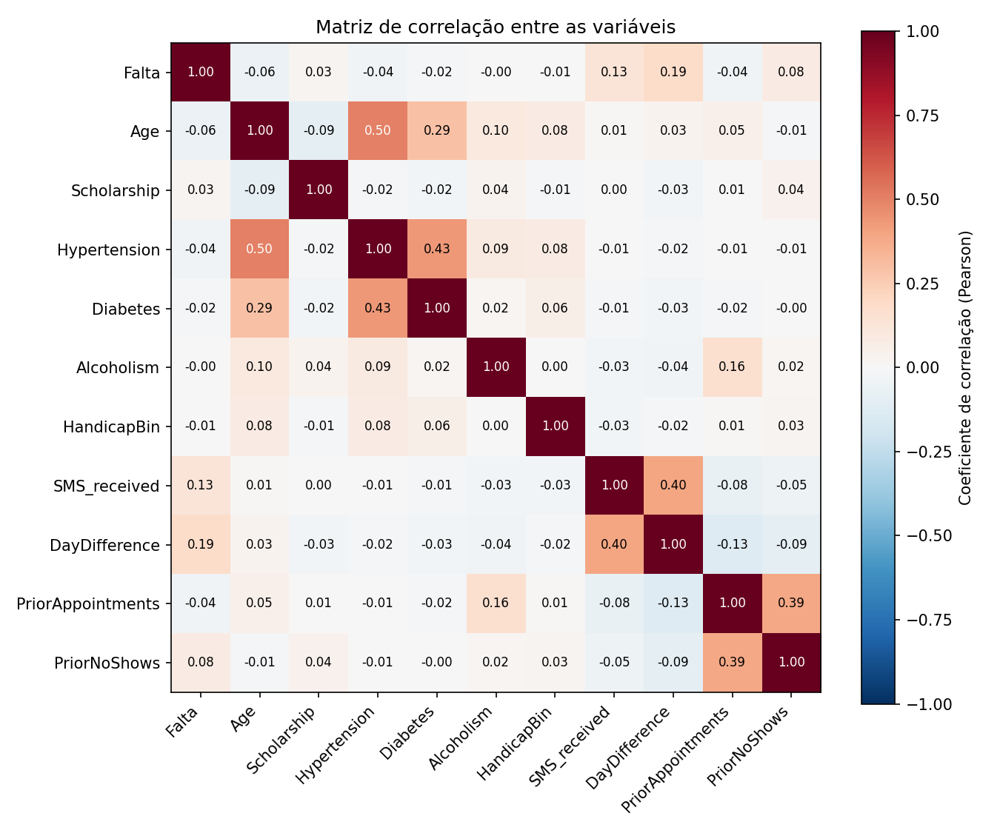

# Análise Exploratória de Dados (EDA) — VittaFlow
## Previsão de Absenteísmo em Consultas Médicas

## 1. Fonte e Qualidade dos Dados

**Fonte original:** [Kaggle — Medical Appointment No Shows](https://www.kaggle.com/datasets/joniarroba/noshowappointments)
**Período:** abril a junho de 2016
**Origem:** consultas médicas do serviço público de saúde de Vitória, Espírito Santo, Brasil

| Métrica | Valor |
|---|---|
| Registros originais | 110.527 |
| Valores nulos encontrados | 0 |
| Linhas duplicadas encontradas | 0 |
| Registros com idade negativa removidos | 1 |
| **Registros na base final** | **110.526** |
| Pacientes únicos | 62.298 |
| Média de consultas por paciente | 1,77 |
| Faixa de idade | 0 a 115 anos (7 registros acima de 100 anos, plausíveis) |

## 2. Distribuição da Variável Alvo

- **Compareceu:** 88.207 consultas (79,8%)
- **Faltou:** 22.319 consultas (20,2%)

Percentual consistente com o reportado por Pereira (2020) na mesma base de dados.

*Figura 1. Distribuição de comparecimento e falta na base de dados.*

## 3. Tempo de Antecedência do Agendamento (fator mais forte)

| Antecedência | % de falta | N |
|---|---|---|
| 0 dias | 4,7% | 38.567 |
| 1 dia | 21,4% | 5.213 |
| 2-3 dias | 23,7% | 9.462 |
| 4-7 dias | 25,2% | 17.510 |
| 8-14 dias | 30,5% | 12.025 |
| 15-30 dias | 32,6% | 17.371 |
| **31-60 dias** | **34,2%** | 8.283 |
| 60+ dias | 28,4% | 2.095 |

Correlação (point-biserial) com falta: **r=0,186, p-valor<0,001** (altamente significativo)

*Figura 2. Taxa de falta por tempo de antecedência do agendamento.*

## 4. Histórico Prévio do Paciente

Pacientes com histórico (≥1 consulta anterior): 48.228 (43,6% da base)

- **Nunca faltou antes** → falta agora: 15,3%
- **Já faltou antes** → falta agora: 26,6%

Correlação (PriorNoShows x Falta): r=0,084, p-valor<0,001

*Figura 3. Taxa de falta conforme histórico prévio do paciente.*

## 5. SMS: Efeito Bruto vs Efeito Controlado (Paradoxo de Simpson)

**Sem controle:** Não recebeu SMS: 16,7% | Recebeu SMS: 27,6%
→ Olhando assim, *parece* que SMS aumenta a falta.

**Controlando pela faixa de antecedência** (comparação dentro do mesmo nível de espera):

| Antecedência | Sem SMS | Com SMS |
|---|---|---|
| 2-3 dias | 24,0% | 21,3% |
| 4-7 dias | 27,1% | 24,0% |
| 8-14 dias | 33,8% | 28,1% |
| 15-30 dias | 36,9% | 29,8% |
| 31-60 dias | 38,4% | 31,5% |
| 60+ dias | 33,9% | 25,5% |

**Dentro de cada faixa de antecedência, quem recebe SMS falta MENOS.** Isso é um **Paradoxo de Simpson**: a variável escondida (antecedência) invertia o resultado agregado, porque quem recebe SMS é, em média, quem tem mais antecedência (correlação SMS x DayDifference = 0,40) — e é esse grupo que mais falta de qualquer forma. Controlando esse fator, o SMS tem sim um efeito protetor real.

*Figura 4. Efeito do SMS na falta, controlando pela antecedência (Paradoxo de Simpson).*

## 6. Gênero

- Feminino: 20,3%
- Masculino: 20,0%

Qui-quadrado: chi2=1,9, p-valor=0,173 → **NÃO significativo**

*Figura 5. Taxa de falta por gênero.*

## 7. Faixa Etária

| Faixa | % de falta |
|---|---|
| 0-5 anos | 18,6% |
| 6-12 anos | 22,8% |
| **13-18 anos** | **26,1%** |
| 19-30 anos | 24,7% |
| 31-45 anos | 21,4% |
| 46-60 anos | 17,8% |
| 60+ anos | 15,2% |

Correlação idade x falta: r=-0,060, p-valor<0,001

*Figura 6. Taxa de falta por faixa etária.*

## 8. Condições de Saúde e Socioeconômicas

| Condição | Sem | Com | p-valor | Significativo? |
|---|---|---|---|---|
| Hipertensão | 20,9% | 17,3% | <0,001 | SIM |
| Diabetes | 20,4% | 18,0% | <0,001 | SIM |
| Alcoolismo | 20,2% | 20,1% | 0,965 | NÃO |
| Deficiência | 20,2% | 18,2% | 0,017 | SIM |
| Bolsa Família | 19,8% | 23,7% | <0,001 | SIM |

**Efeito cumulativo (total de condições):**

| Nº de condições | % de falta | N |
|---|---|---|
| 0 | 20,9% | 84.114 |
| 1 | 17,9% | 18.123 |
| 2 | 17,9% | 7.658 |
| 3 | 15,4% | 618 |
| 4 | 30,8% | 13 (amostra pequena, pouco conclusivo) |

*Figura 7. Taxa de falta conforme condições de saúde e socioeconômicas.*

## 9. Dia da Semana da Consulta

| Dia | % de falta |
|---|---|
| Segunda | 20,6% |
| Terça | 20,1% |
| Quarta | 19,7% |
| Quinta | 19,4% |
| Sexta | 21,2% |
| Sábado | 23,1% |

*Figura 8. Taxa de falta por dia da semana da consulta.*

## 10. Variação Geográfica (Bairro)

Faixa observada (mín. 200 consultas por bairro): **14,6% a 28,9%**

Teste qui-quadrado (omnibus, 80 graus de liberdade): chi2=492,0, p-valor<0,001 → **SIM significativo**

**Top 5 piores bairros:**

| Bairro | % de falta | N |
|---|---|---|
| Santos Dumont | 28,9% | 1.276 |
| Santa Cecília | 27,5% | 448 |
| Santa Clara | 26,5% | 506 |
| Itararé | 26,3% | 3.514 |
| Jesus de Nazareth | 24,4% | 2.853 |

*Figura 9. 10 bairros com maior taxa de falta (mínimo 200 consultas).*

## 11. Matriz de Correlação Completa

| Variável | Correlação com Falta |
|---|---|
| DayDifference | +0,186 |
| SMS_received | +0,126 |
| PriorNoShows | +0,084 |
| Scholarship | +0,029 |
| Alcoholism | -0,000 |
| HandicapBin | -0,007 |
| Diabetes | -0,015 |
| PriorAppointments | -0,036 |
| Hypertension | -0,036 |
| Age | -0,060 |

*Figura 10. Matriz de correlação entre as variáveis (coeficiente de Pearson).*
