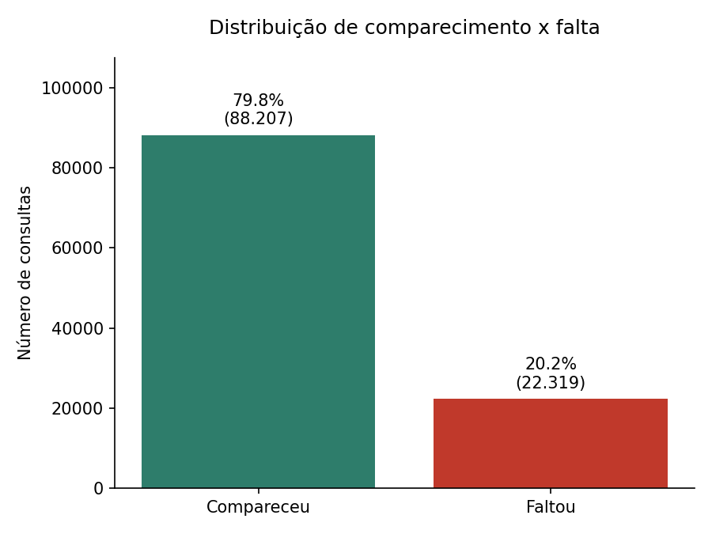

# Análise Exploratória de Dados (EDA) — VittaFlow
## Previsão de Absenteísmo em Consultas Médicas

## 1. Fonte e Qualidade dos Dados

**Fonte original:** [Kaggle — Medical Appointment No Shows](https://www.kaggle.com/datasets/joniarroba/noshowappointments)
**Período:** abril a junho de 2016
**Origem:** consultas médicas do serviço público de saúde de Vitória, Espírito Santo, Brasil

| Métrica | Valor |
|---|---|
| Registros originais | 110.527 |
| Valores nulos encontrados | 0 |
| Linhas duplicadas encontradas | 0 |
| Registros com idade negativa removidos | 1 |
| **Registros na base final** | **110.526** |
| Pacientes únicos | 62.298 |
| Média de consultas por paciente | 1,77 |
| Faixa de idade | 0 a 115 anos (7 registros acima de 100 anos, plausíveis) |

## 2. Distribuição da Variável Alvo

- **Compareceu:** 88.207 consultas (79,8%)
- **Faltou:** 22.319 consultas (20,2%)

Percentual consistente com o reportado por Pereira (2020) na mesma base de dados.

*Figura 1. Distribuição de comparecimento e falta na base de dados.*